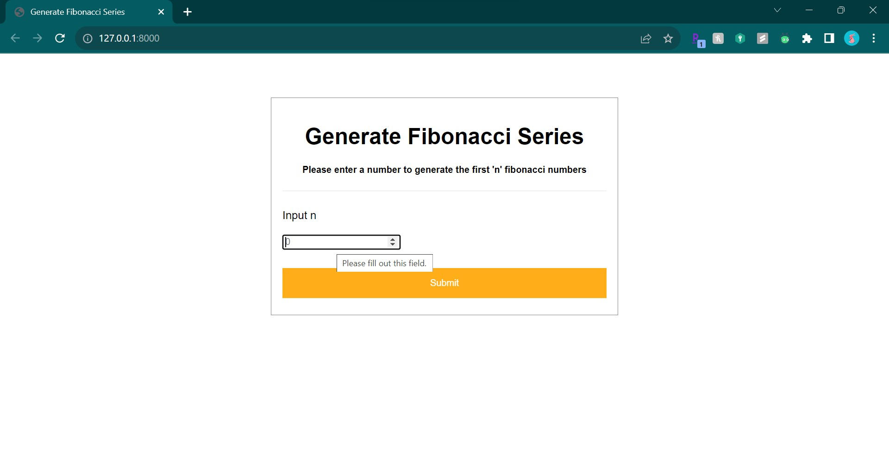
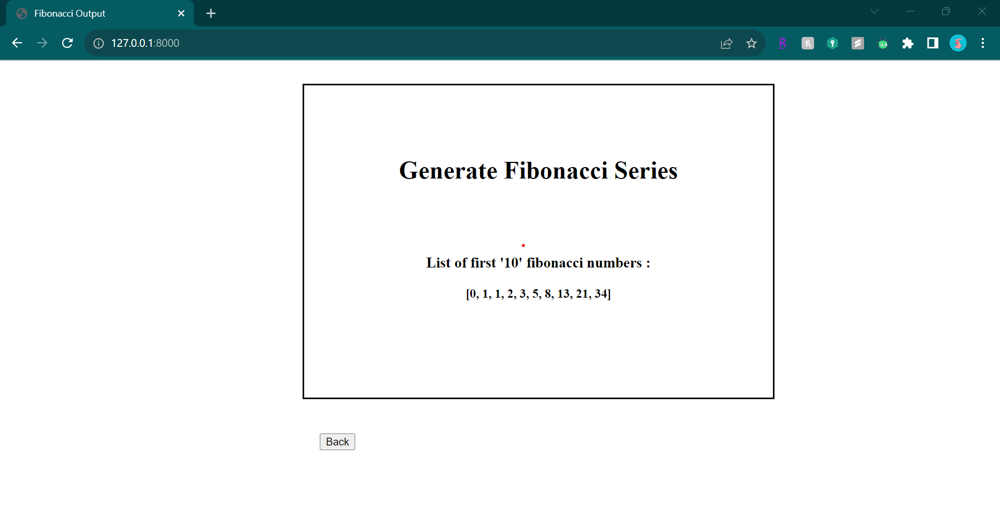

# fibonacci_series_generator

The web application "fibonacci_series_generator" generates a series of 'n' fibonacci number by taking 'n' as user input

## Requirements

* Operating System: Windows, Linux, or macOS
* IDE: PyCharm Community, or VS Code
* Programming Language: Python 3.8+, JavaScript, HTML, CSS
* Framework: Django
* Relational Database: DB SQLite3

## Installation Instructions

1. Clone the repository from GitHub.
2. Create a virtual environment and activate it.
3. Install the dependencies using pip.
   - pip install -r requirements.txt
5. Run the application using the following command:

python manage.py runserver

## Usage Instructions

The application can be accessed at http://localhost:8000.

## Results

After the server is up and running

The below page is visible:

Enter the input 'n' and click on submit button.
Then it redirects to the below page, where the list of first 'n' fibonacci numbers is generated.

You can click on 'back' button to go to the first page to generate another sequence. 

